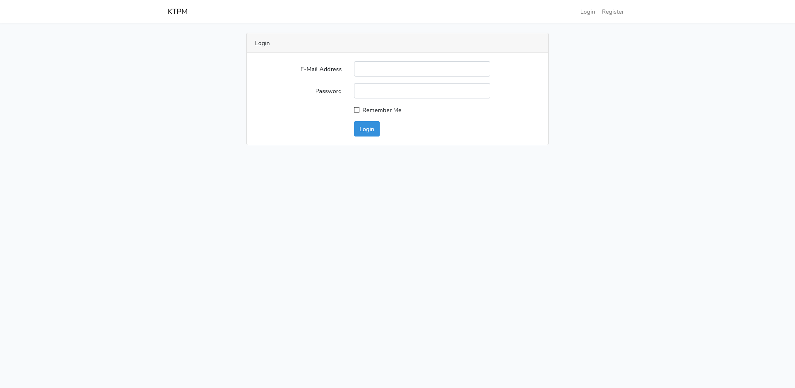
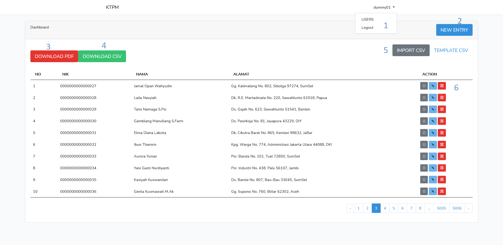
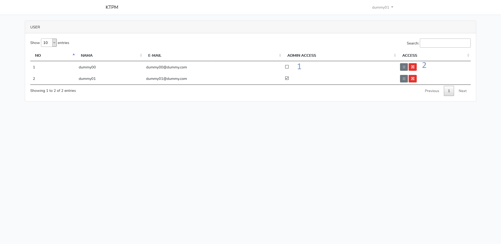

# laravelTest
Test aplikasi KTP web dengan framework laravel
* Folder DatabaseExport berisi file .sql yang digunakan untuk uji coba aplikasi ini
* Folder KTPManager adalah folder dari project laravel yang dikerjakan

# KTPManager
**Login :**

 
Sudah terdapat 2 akun dummy yang bisa digunakan untuk login:
* e-mail: dummy00@dummy.com ; pass: dummy00.
* e-mail: dummy01@dummy.com ; pass: dummy01.

Ada 2 tipe akses di aplikasi ini, admin dan user.
dummy00 memiliki hak akses user dan dummy01 memiliki hak akses admin.

**Home/Dashboard :**

 
Halaman awal setelah melakukan login.
1. Menu dropdown berisi menu User *(hanya dapat diakses oleh admin)* yang digunakan untuk memanage user yang sudah terdaftar dan menu Logout untuk keluar dari akun yang sedang digunakan.
2. Menu untuk menambahkan data KTP baru *(hanya dapat diakses oleh admin)*.
3. Menu untuk mengekspor data KTP kedalam file PDF.
4. Menu untuk mengekspor data KTP kedalam file CSV.
5. Menu untuk mengimpor data dari file CSV dan template file CSV-nya *(hanya dapat diakses oleh admin)*.
	* Format tanggal yang digunakan adalah d/m/Y
6. Menu untuk melihat detail KTP, mengedit KTP, dan menghapus KTP *(edit dan hapus hanya dapat diakses oleh admin)*.

**Users :**

 
Halaman untuk memanage user *(hanya dapat diakses oleh admin)*.
1. Checkbox untuk memberi / menghapus hak akses admin pada user.
2. Menu untuk melihat aktifitas user dan menghapus user.

**API :**

API aplikasi ini dapat diakses dengan url "/api/ktpApi" (contoh: http://localhost:8000/api/ktpApi).

Parameter yang digunakan untuk masing-masing request:
* GET = tidak memerlukan parameter
* POST = ["nama","tempatLahir","tanggalLahir","jenisKelamin","golDarah","alamat","agama","kawin","pekerjaan","wn"]
* PUT = ["id","nama","tempatLahir","tanggalLahir","jenisKelamin","golDarah","alamat","agama","kawin","pekerjaan","wn"]
* DELETE = ["id"]